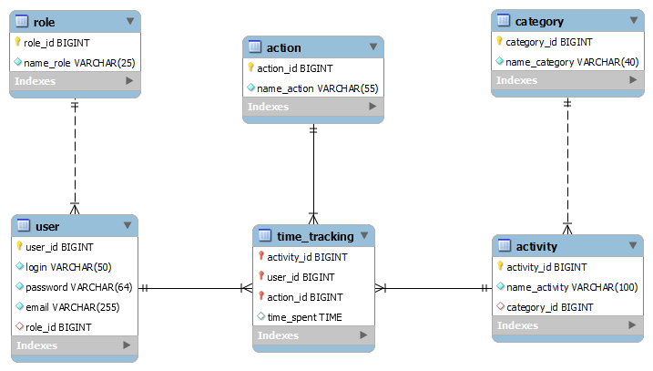
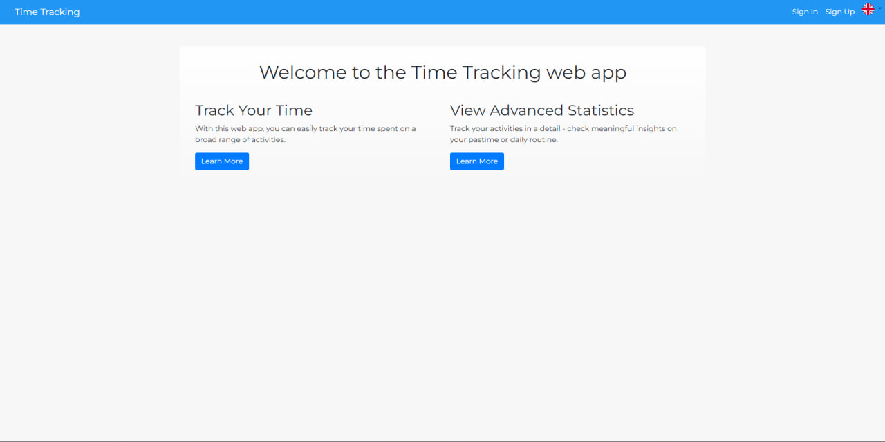
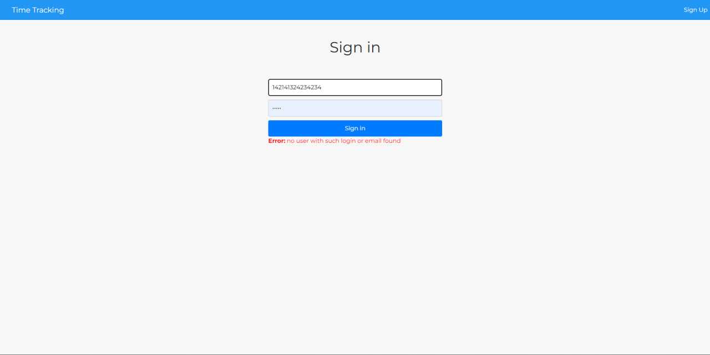
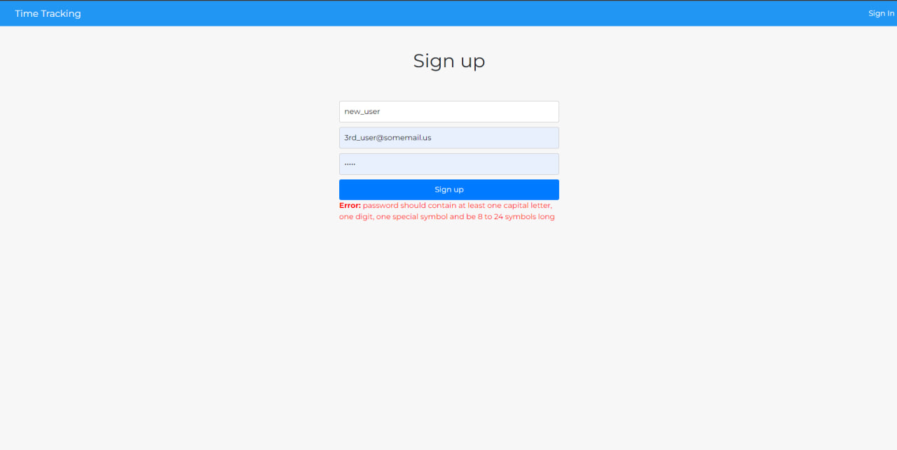
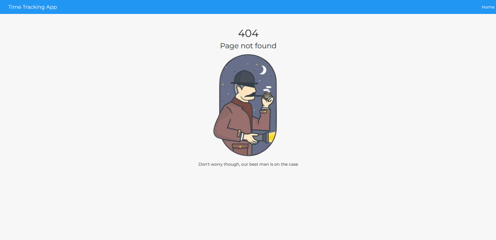

# Time tracking system
The goal was to build robust layered project architecture that separates the presentation, business, and data access layers so that one can easily change specific technology without having to rewrite other layers.     
Here are three different versions of this architecture using different frameworks and technologies, such as Flask, Django, SQLAlchemy, Django ORM, and own DAO implementation.

## Tech stack
| Tool      | Solution                           |
|-----------|------------------------------------|
| DBMS      | MySQL                              |
| Server    | Waitress (pure Python WSGI server) |
| ORM       | None (DAO instead)                 |
| Patterns  | DAO, Command, MVC                  |     

## How to install & run
1. `git clone https://github.com/vr256/software_architecture.git`
2. `cd software_architecture` 
3. `git checkout remotes/origin/flask`
4. `pip install venv`  
5. `python -m venv venv`  
6. `venv/Scripts/activate`  
7. `pip install -r requirements.txt`  
8. `waitress-serve --listen=*:8000 time_tracking:app`
9. Open http://127.0.0.1:8000/

## Database schema
  

## Screenshots

  
  
  
  

